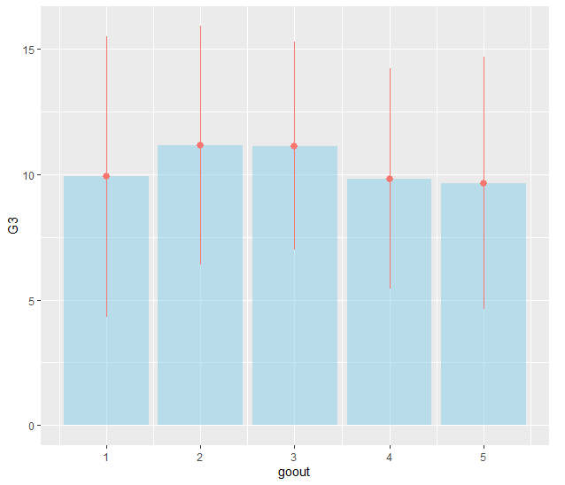
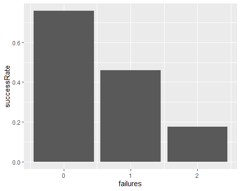
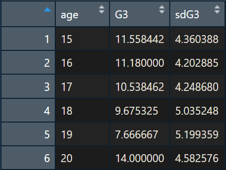

# Student Performance Case Study (Clustering/Classification)

- [Student Performance Case Study (Clustering/Classification)](#student-performance-case-study-clusteringclassification)
  - [Step 1: Identify business problem](#step-1-identify-business-problem)
    - [Question 1: What are the problems that we are trying to solve in this assignment?](#question-1-what-are-the-problems-that-we-are-trying-to-solve-in-this-assignment)
    - [Question 2: What are the algorithms that could be used to solve each problem?](#question-2-what-are-the-algorithms-that-could-be-used-to-solve-each-problem)
  - [Step 2: Identify data sources and acquire data](#step-2-identify-data-sources-and-acquire-data)
  - [Step 3: Process/Clean data](#step-3-processclean-data)
    - [Question 3: Find the number of missing data for each feature.](#question-3-find-the-number-of-missing-data-for-each-feature)
    - [Question 4: What is the best way to deal with missing data (delete, calculate the average or the median, etc.)?](#question-4-what-is-the-best-way-to-deal-with-missing-data-delete-calculate-the-average-or-the-median-etc)
    - [Question 5: Using an outlier detection technique (such as scatter, Z-score, or Box Plot), find if there are any outliers in the data (give these outliers).](#question-5-using-an-outlier-detection-technique-such-as-scatter-z-score-or-box-plot-find-if-there-are-any-outliers-in-the-data-give-these-outliers)
  - [Step 4: Perform exploratory analysis](#step-4-perform-exploratory-analysis)
    - [Question 6: Discover the relationship between going out and the grades of students (in other words, does, for example, going out so often affect the results of the student?)](#question-6-discover-the-relationship-between-going-out-and-the-grades-of-students-in-other-words-does-for-example-going-out-so-often-affect-the-results-of-the-student)
    - [Question 7: Is there a relationship between family size and the result of students?](#question-7-is-there-a-relationship-between-family-size-and-the-result-of-students)
    - [Question 8: Does the quality of the family relationship affect students' results? Explain your answer.](#question-8-does-the-quality-of-the-family-relationship-affect-students-results-explain-your-answer)
    - [Question 9: Does the school travel time affect students result? Explain your answer.](#question-9-does-the-school-travel-time-affect-students-result-explain-your-answer)
    - [Question 10: What type of relationship does exist between the previous failures and students' results? (in other words, if a student previously failed does this mean he/she will pass?!)](#question-10-what-type-of-relationship-does-exist-between-the-previous-failures-and-students-results-in-other-words-if-a-student-previously-failed-does-this-mean-heshe-will-pass)
    - [Question 11: Do extra activities help to improve student performance?](#question-11-do-extra-activities-help-to-improve-student-performance)
    - [Question 12: Does internet home access help to improve student performance?](#question-12-does-internet-home-access-help-to-improve-student-performance)
    - [Question 13: What is the distribution of students who succeeded over the levels of free time?](#question-13-what-is-the-distribution-of-students-who-succeeded-over-the-levels-of-free-time)
    - [Question 14: What is the relationship between age and student result?](#question-14-what-is-the-relationship-between-age-and-student-result)
    - [Question 15: What is the relationship between address and student result?](#question-15-what-is-the-relationship-between-address-and-student-result)
    - [Question 16: What is the relationship between study time and student result?](#question-16-what-is-the-relationship-between-study-time-and-student-result)
    - [Question 17: Does absence affect student performance?](#question-17-does-absence-affect-student-performance)
    - [Question 18: Does health affect student performance?](#question-18-does-health-affect-student-performance)
    - [Question 19: Does mother and father education/job affect student result?](#question-19-does-mother-and-father-educationjob-affect-student-result)
  - [Step 5: Generate the model](#step-5-generate-the-model)
    - [Question 20: Give the useful variables to perform the clustering and classification. Remove the non-useful variables if there are any.](#question-20-give-the-useful-variables-to-perform-the-clustering-and-classification-remove-the-non-useful-variables-if-there-are-any)
    - [Question 21: Are there any features that we need to add to the dataset? Identify and add these features to the dataset?](#question-21-are-there-any-features-that-we-need-to-add-to-the-dataset-identify-and-add-these-features-to-the-dataset)
    - [Question 22: Is there any data needed to be normalized? What techniques of normalization could be used?](#question-22-is-there-any-data-needed-to-be-normalized-what-techniques-of-normalization-could-be-used)
  - [Step 6: Validate the model](#step-6-validate-the-model)
    - [part 1](#part-1)
    - [Question 23: Do the clustering based on these features with k=7. Showcase your results (plot of clusters).](#question-23-do-the-clustering-based-on-these-features-with-k7-showcase-your-results-plot-of-clusters)
    - [Question 24: Calculate the within-cluster variation.](#question-24-calculate-the-within-cluster-variation)
    - [Question 25: Do the clustering based on these features with k=7. Showcase your results (plot of clusters).](#question-25-do-the-clustering-based-on-these-features-with-k7-showcase-your-results-plot-of-clusters)
    - [Question 26: Calculate the within-cluster variation.](#question-26-calculate-the-within-cluster-variation)
    - [Question 27: Do the clustering based on these features with k=7. Showcase your results (plot of clusters).](#question-27-do-the-clustering-based-on-these-features-with-k7-showcase-your-results-plot-of-clusters)
    - [Question 28: Calculate the within-cluster variation.](#question-28-calculate-the-within-cluster-variation)
    - [Question 29: Is this clustering better or worse than the previous ones? Explain your answer.](#question-29-is-this-clustering-better-or-worse-than-the-previous-ones-explain-your-answer)
    - [Question 30: Find the appropriate number of clusters (k) for the student performance data.](#question-30-find-the-appropriate-number-of-clusters-k-for-the-student-performance-data)
    - [part 2](#part-2)
    - [Question 31: Do the classification using KNN algorithm.](#question-31-do-the-classification-using-knn-algorithm)
    - [Question 32: Assess the performance of the model for different values of K (number of neighbors) using confusion-matrix and accuracy.](#question-32-assess-the-performance-of-the-model-for-different-values-of-k-number-of-neighbors-using-confusion-matrix-and-accuracy)
    - [Question 33: Find the best value of K.](#question-33-find-the-best-value-of-k)
    - [Question 34: Do the classification using SVM algorithm.](#question-34-do-the-classification-using-svm-algorithm)
    - [Question 35: Assess the performance of the model using confusion-matrix and accuracy.](#question-35-assess-the-performance-of-the-model-using-confusion-matrix-and-accuracy)
    - [Question 36: Compare the performance of SVM to the accuracy of KNN.](#question-36-compare-the-performance-of-svm-to-the-accuracy-of-knn)
    - [part 3](#part-3)
    - [Question 37: In order to answer this question, show the distribution of the results for each cluster. Explain the results.](#question-37-in-order-to-answer-this-question-show-the-distribution-of-the-results-for-each-cluster-explain-the-results)
  - [Step 7: Visualize results](#step-7-visualize-results)
    - [Question 38: Create graphs to present important results concluded from the previous step. Comment on those graphs.](#question-38-create-graphs-to-present-important-results-concluded-from-the-previous-step-comment-on-those-graphs)

<div style="page-break-after: always;"></div>

## Step 1: Identify business problem

### Question 1: What are the problems that we are trying to solve in this assignment?

**Solution 1:**

1. Find out what makes the students' performance higher.
2. Predict students' performance

### Question 2: What are the algorithms that could be used to solve each problem?

**Solution 2:**

Both problems could be solved with the following algorithms, but not limited to:

Using Clustering:

1. K-means
2. Mean-Shift
3. Expectation-Maximization (EM) Clustering using Gaussian Mixture Models (GMM)
4. Agglomerative Hierarchical Clustering

Using Classification:

1. Logistic Regression
2. Naive Bayes classifier
3. Least squares support vector machines
4. k-nearest neighbour
5. Random forests

## Step 2: Identify data sources and acquire data

** Students' Comment:** The data provided is extracted, transformed and given to us on this assignment. This is far from real scenarios, where identifying the data sources is very crucial. Examples for this particular scenario:

1. Gabriel Pereira student database
1. Mousinho da Silveira database
1. Students school survey database
1. National Education Authority published datasets

After the identification and acquisition of data, we read it with the programming language of choice. We have selected R as our programming language with Rstudio as our IDE.

Our project structure is as follows:

```sh
        Assignment: Student Performance Case Study [Project folder] (/)
                |
                |______ assignment-1.Rproj
                |
                |______ assignment.R
                |
                |______ BDA-Assignment-2019.pdf
                |
                |______ data set.csv
                |
                |______ README.md
                |
                |
            Other files

```

Our R code to read the data will be:

```r
# Check if the project folder is our current directory
getwd()

# If this outputs a directory other than the project folder, set the working directory using `setwd()`

# Read the data set
data <- read.csv("data set.csv")
```

R Console Output

```r
> # Check if the project folder is our current directory
> getwd()
[1] "D:/Machine Learning/Assignment: Student Performance Case Study"
>
> # Read the data set
> data <- read.csv("data set.csv")
```

## Step 3: Process/Clean data

### Question 3: Find the number of missing data for each feature.

R code

```r
# counting NAs of each column

# We are applying the function of x defined as the sum of na counts
# to each column and returning a matrix of counts of NAs in each column
sapply(data, function(x) sum(is.na(x)))
```

R Console Output

```r
> # counting NAs of each column
>
> # We are applying the function of x defined as sum of na counts
> # to each column and returning a matrix of counts of NAs in each column
> sapply(data, function(x) sum(is.na(x)))
         X     school        sex        age    address    famsize    Pstatus       Medu       Fedu       Mjob
         0          0          0          0          0          0          0          0          1          0
      Fjob     reason   guardian traveltime  studytime   failures  schoolsup     famsup       paid activities
         0          0          0          2          0          1          0          0          0          0
   nursery     higher   internet   romantic     famrel   freetime      goout     health   absences         G1
         0          0          0          0          1          1          0          1          0          1
        G2         G3
         0          1
```

**Solution 3:**

### Question 4: What is the best way to deal with missing data (delete, calculate the average or the median, etc.)?

**Solution 4:** There are many ways to deal with missing data, on a broad level the three are the most used: </br>

1. Delete the entire record. </br>
1. Create a separate model to impute the missing data. </br>
1. Statistical methods like mean, median, mode, etc. </br>

The method to use depends on the kind of data that is missing. Is it going to skew our results if some records were deleted entirely? Alternatively, if there are lots of missing records and we assume a mean value for all those records, the deviations from the mean would be far less from the actual reality.

R Code

```r
# Find out all data with one or more NAs
data.incomplete <- data[!complete.cases(data), ]
```

In our scenario, the records with missing values are less (1.25% of the dataset)

As we are trying to predict performance, the records with no grades would be deleted. (Record 397 and 398)

For other missing records, the following code should do the trick. We have used mean and mode to impute some of the missing values as appropriate to the features.

R Code

```r
# split data between 2 schools and handle missing values.
require(dplyr)  # loading required library for filter and mutate functions

data.GP <- data %>% filter(school == "GP")  # seperate dataset for GP

# Create the mode function.
getmode <- function(v) {
  uniqv <- unique(v)
  uniqv[which.max(tabulate(match(v, uniqv)))]
}

# mode value inserted in case of NAs were features are most likely highest occurance
data.GP$Fedu[is.na(data.GP$Fedu)] <- getmode(data.GP$Fedu)  # Mode father's education
data.GP$famrel[is.na(data.GP$famrel)] <- getmode(data.GP$famrel)  # Mode of family relation

# Mean value inserted in case of NAs where features are most likely the average
data.GP$traveltime[is.na(data.GP$traveltime)] <- mean(data.GP$traveltime, na.rm = T)  # Mean of Travel time
data.GP$freetime[is.na(data.GP$freetime)] <- mean(data.GP$freetime, na.rm = T)  # Mean of Free time

# Same is being done for MS
data.MS <- data %>% filter(school == "MS")  # seperate dataset for MS

# mode value inserted in case of NAs were features are most likely highest occurance
data.MS$Fedu[is.na(data.MS$Fedu)] <- getmode(data.MS$Fedu)  # mode father's education
data.MS$famrel[is.na(data.MS$famrel)] <- getmode(data.MS$famrel)  # mode of family relation

# Mean value inserted in case of NAs where features are most likely the average
data.MS$traveltime[is.na(data.MS$traveltime)] <- mean(data.MS$traveltime, na.rm = T)  # Mean of Travel time
data.MS$freetime[is.na(data.MS$freetime)] <- mean(data.MS$freetime, na.rm = T)  # Mean of Free time

# combining the data to get back to the original data set with a few missing values imputed.
data <- rbind(data.GP, data.MS)

# Deleting records with missing values
data <- na.omit(data)  # 2 records deleted (397 and 398)

# soring based on column X (index numbers)
data <- data[order(data$X), ]
```

R Console Output

```r
> require(dplyr)  # loading required library for filter and mutate functions
>
> data.GP <- data %>% filter(school == "GP")  # seperate dataset for GP
>
> # Create the mode function.
> getmode <- function(v) {
+   uniqv <- unique(v)
+   uniqv[which.max(tabulate(match(v, uniqv)))]
+ }
>
> # mode value inserted in case of NAs were features are most likely highest occurance
> data.GP$Fedu[is.na(data.GP$Fedu)] <- getmode(data.GP$Fedu)  # Mode father's education
> data.GP$famrel[is.na(data.GP$famrel)] <- getmode(data.GP$famrel)  # Mode of family relation
>
> # Mean value inserted in case of NAs where features are most likely the average
> data.GP$traveltime[is.na(data.GP$traveltime)] <- mean(data.GP$traveltime, na.rm = T)  # Mean of Travel time
> data.GP$freetime[is.na(data.GP$freetime)] <- mean(data.GP$freetime, na.rm = T)  # Mean of Free time
>
> # Same is being done for MS
> data.MS <- data %>% filter(school == "MS")  # seperate dataset for MS
>
> # mode value inserted in case of NAs were features are most likely highest occurance
> data.MS$Fedu[is.na(data.MS$Fedu)] <- getmode(data.MS$Fedu)  # mode father's education
> data.MS$famrel[is.na(data.MS$famrel)] <- getmode(data.MS$famrel)  # mode of family relation
>
> # Mean value inserted in case of NAs where features are most likely the average
> data.MS$traveltime[is.na(data.MS$traveltime)] <- mean(data.MS$traveltime, na.rm = T)  # Mean of Travel time
> data.MS$freetime[is.na(data.MS$freetime)] <- mean(data.MS$freetime, na.rm = T)  # Mean of Free time
>
> # combining the data to get back to the original data set with a few missing values imputed.
> data <- rbind(data.GP, data.MS)
>
> # Deleting records with missing values
> data <- na.omit(data)  # 2 records deleted (397 and 398)
>
> # soring based on column X (index numbers)
> data <- data[order(data$X), ]
```

### Question 5: Using an outlier detection technique (such as scatter, Z-score, or Box Plot), find if there are any outliers in the data (give these outliers).

**Solution 5:**

Using the z-scores, we could remove all the outliers by filtering out all records where the z-scores are above three or below -3.

Formula:
$$
z-score =  \frac{(x - \mu)}{\sigma}
$$

R Code

```r
# Detecting outlier
# Using Z - scores
data.z.scores <- data %>% mutate(ageZScore = scale(age),
                                 MeduZScore = scale(Medu),
                                 FeduZScore = scale(Fedu),
                                 travelZScore = scale(traveltime),
                                 studyZScore = scale(studytime),
                                 failuresZScore = scale(failures),
                                 famrelZScore = scale(famrel),
                                 freetimeZScore = scale(freetime),
                                 gooutZScore = scale(goout),
                                 healthZScore = scale(health),
                                 absencesZScore = scale(absences),
                                 G1ZScore = scale(G1),
                                 G2ZScore = scale(G2),
                                 G3ZScore = scale(G3))

# Summary of the data
summary(data.z.scores)
```

Output:


So clearly, features that have outliers based on z-scores are:

1. age
2. traveltime
3. failures
4. absences

Based on the z-scores, 29 records will be dropped as they contain outliers.

```r
# Removing outliers
data.z.scores <- data.z.scores %>% filter(ageZScore >= -3 & ageZScore <= 3
                                          & travelZScore >= -3 & travelZScore <= 3
                                          & failuresZScore >= -3 & failuresZScore <= 3
                                          & absencesZScore >= -3 & absencesZScore <= 3)

# Dropping the z scores columns and overwriting the result to data
data <- data.z.scores[, 1:32]
```

## Step 4: Perform exploratory analysis

### Question 6: Discover the relationship between going out and the grades of students (in other words, does, for example, going out so often affect the results of the student?)

**Solution 6:**

R Code:

```r
# Loading required library for plots
require(ggplot2)

# finding out the relationship between going out and grade
result.goout <- data %>%
  mutate(sdG3 = G3) %>%
  group_by(goout) %>%
  summarise(G3 = mean(G3), sdG3 = sd(sdG3))

# View result.goout
View(result.goout)

# Plot of the relation between going out and grade with error bars
result.goout %>%
  ggplot(aes(x = goout, y = G3)) +
  geom_bar(stat = "identity",
           fill = "skyblue",
           alpha = 0.5) +
  geom_pointrange(aes(
    x = goout,
    y = G3,
    ymin = G3 - sdG3,
    ymax = G3 + sdG3,
    colour = "orange"
  )) +
  theme(legend.position = "none")
```

Output:




From the histogram, we can safely say that who go out moderately tend to get better grades.

### Question 7: Is there a relationship between family size and the result of students?

**Solution 7:**

R Code:

```r
# finding out the relationship between family size and grade
result.famsize <- data %>%
  mutate(sdG3 = G3) %>%
  group_by(famsize) %>%
  summarise(G3 = mean(G3), sdG3 = sd(sdG3))

# View result.famsize
View(result.famsize)

# Plot of the relation between family size and grade with error bars
result.famsize %>%
  ggplot(aes(x = famsize, y = G3)) +
  geom_bar(stat = "identity",
           fill = "skyblue",
           alpha = 0.5) +
  geom_pointrange(aes(
    x = famsize,
    y = G3,
    ymin = G3 - sdG3,
    ymax = G3 + sdG3,
    colour = "orange"
  ))
```

Output:


From the histogram, we can see that students from a family size of less or equal to 3 get better grades than a family size larger than 3.

### Question 8: Does the quality of the family relationship affect students' results? Explain your answer.

**Solution 8:**

R Code:

```r
# finding out the relationship between family relationship quality and grade
result.famrel <- data %>%
  mutate(sdG3 = G3) %>%
  group_by(famrel) %>%
  summarise(G3 = mean(G3), sdG3 = sd(sdG3))

# View result.famrel
View(result.famrel)

# Plot of the relation between family relationship quality and grade with error bars
result.famrel %>%
  ggplot(aes(x = famrel, y = G3)) +
  geom_bar(stat = "identity",
           fill = "skyblue",
           alpha = 0.5) +
  geom_pointrange(aes(
    x = famrel,
    y = G3,
    ymin = G3 - sdG3,
    ymax = G3 + sdG3,
    colour = "orange"
  )) +
  theme(legend.position = "none")
```

Output:


We have too few data points on lower family relationship quality. However, we can observe that grades increase with higher family relationship quality. This can be seen from the increase in lowest grades with an increase in family relationship quality.

A direct relationship exists.

### Question 9: Does the school travel time affect students result? Explain your answer.

**Solution 9:**

R Code:

```r
# finding out the relationship between travel time and grade
result.traveltime <- data %>%
  mutate(sdG3 = G3) %>%
  group_by(traveltime) %>%
  summarise(G3 = mean(G3), sdG3 = sd(sdG3))

# View result.traveltime
View(result.traveltime)

# Plot of the relationship between travel time and grade with error bars
result.traveltime %>%
  ggplot(aes(x = traveltime, y = G3)) +
  geom_bar(stat = "identity",
           fill = "skyblue",
           alpha = 0.5) +
  geom_pointrange(aes(
    x = traveltime,
    y = G3,
    ymin = G3 - sdG3,
    ymax = G3 + sdG3,
    colour = "orange"
  )) +
  theme(legend.position = "none")
```

Output:


With the increase in travel time, student's grades decrease.

There exists an inverse relationship.

### Question 10: What type of relationship does exist between the previous failures and students' results? (in other words, if a student previously failed does this mean he/she will pass?!)

**Solution 10:**

R Code:

```r
# finding out the relationship between previous failures and success
result.failures <-
  data %>%
  mutate(success = ifelse(G3 >= 10, 1, 0), fail = ifelse(G3 < 10, 1, 0)) %>%
  group_by(failures) %>%
  summarise(success = sum(success), fail = sum(fail)) %>%
  mutate(successRate = success/(success + fail))
# View result.failures
View(result.failures)
# plot result.failures
result.failures %>%
  ggplot(aes(x = failures, y = successRate)) + geom_bar(stat = "identity")
```

Output:




Yes, the students with previous failures have a strong proportional effect on results.
In other words, as the number of times, a student failed in the past increases, the more probability of the student failing in future.

An inverse relationship exists between past failures and future success.

### Question 11: Do extra activities help to improve student performance?

**Solution 11:**

```r
# finding out if extra activities help improve student performance
result.activities <- data %>%
  mutate(sdG3 = G3) %>%
  group_by(activities) %>%
  summarise(G3 = mean(G3), sdG3 = sd(sdG3))

# View result.activities
View(result.activities)

# Plot of the relation between extra activities and grade with error bars
result.activities %>%
  ggplot(aes(x = activities, y = G3)) +
  geom_bar(stat = "identity",
           fill = "skyblue",
           alpha = 0.5) +
  geom_pointrange(aes(
    x = activities,
    y = G3,
    ymin = G3 - sdG3,
    ymax = G3 + sdG3,
    colour = "orange"
  )) +
  theme(legend.position = "none")
```

Output:


No, there is not much difference between students involved in extra activities and the ones who are not.

### Question 12: Does internet home access help to improve student performance?

**Solution 12:**

R Code:

```r
# finding out if home internet access help improve student performance ------------------
result.internet <- data %>%
  mutate(sdG3 = G3) %>%
  group_by(internet) %>%
  summarise(G3 = mean(G3), sdG3 = sd(sdG3))

# View result.internet
View(result.internet)

# Plot of the relation between home internet access and grade with error bars
result.internet %>%
  ggplot(aes(x = internet, y = G3)) +
  geom_bar(stat = "identity",
           fill = "skyblue",
           alpha = 0.5) +
  geom_pointrange(aes(
    x = internet,
    y = G3,
    ymin = G3 - sdG3,
    ymax = G3 + sdG3,
    colour = "orange"
  )) +
  theme(legend.position = "none")
```

Output:


Yes, home internet access increases students' performance.

### Question 13: What is the distribution of students who succeeded over the levels of free time?

**Solution 13:**

R Code:

```r
# finding out the free time distribution over and success cases
result.freetime <-
  data %>%
  mutate(success = ifelse(G3 >= 10, 1, 0), fail = ifelse(G3 < 10, 1, 0)) %>%
  group_by(freetime) %>%
  summarise(success = sum(success), fail = sum(fail)) %>%
  mutate(successRate = success / (success + fail))
# View result.freetime
View(result.freetime)
# plot result.freetime
result.freetime %>%
  ggplot(aes(x = freetime, y = successRate)) +
  geom_bar(stat = "identity",
           fill = "skyblue",
           alpha = 0.5)
```

Output:


### Question 14: What is the relationship between age and student result?

**Solution 14:**

R Code:

```r
# finding out the relationship between age and student performance
result.age <- data %>%
  mutate(sdG3 = G3) %>%
  group_by(age) %>%
  summarise(G3 = mean(G3), sdG3 = sd(sdG3))

# View result.age
View(result.age)

# Plot of the relation between home age access and grade with error bars
result.age %>%
  ggplot(aes(x = age, y = G3)) +
  geom_bar(stat = "identity",
           fill = "skyblue",
           alpha = 0.5) +
  geom_pointrange(aes(
    x = age,
    y = G3,
    ymin = G3 - sdG3,
    ymax = G3 + sdG3,
    colour = "orange"
  )) +
  theme(legend.position = "none")
```
Output:




### Question 15: What is the relationship between address and student result?

**Solution 15:**

R Code:

```r
# finding out the relationship between address and student performance
result.address <- data %>%
  mutate(sdG3 = G3) %>%
  group_by(address) %>%
  summarise(G3 = mean(G3), sdG3 = sd(sdG3))

# View result.address
View(result.address)

# Plot of the relation between home address access and grade with error bars
result.address %>%
  ggplot(aes(x = address, y = G3)) +
  geom_bar(stat = "identity",
           fill = "skyblue",
           alpha = 0.5) +
  geom_pointrange(aes(
    x = address,
    y = G3,
    ymin = G3 - sdG3,
    ymax = G3 + sdG3,
    colour = "orange"
  )) +
  theme(legend.position = "none")
```

Output:


Urban students perform better than rural students.

### Question 16: What is the relationship between study time and student result?

**Solution 16:**

R Code:

```r
# finding out the relationship between study time and student performance
result.studytime <- data %>%
  mutate(sdG3 = G3) %>%
  group_by(studytime) %>%
  summarise(G3 = mean(G3), sdG3 = sd(sdG3))

# View result.studytime
View(result.studytime)

# Plot of the relationship between study time and grade with error bars
result.studytime %>%
  ggplot(aes(x = studytime, y = G3)) +
  geom_bar(stat = "identity",
           fill = "skyblue",
           alpha = 0.5) +
  geom_pointrange(aes(
    x = studytime,
    y = G3,
    ymin = G3 - sdG3,
    ymax = G3 + sdG3,
    colour = "orange"
  )) +
  theme(legend.position = "none")
```

Output:


There are slight improvements in students' performance with an increase in study time.

### Question 17: Does absence affect student performance?

**Solution 17:**

```r
# finding out the relationship between absences and student performance
result.absences <- data

# Plot of the relation between home absences access and grade
result.absences %>%
  ggplot(aes(x = absences, y = G3)) +
  geom_point() +
  theme(legend.position = "none") +
  geom_smooth(method='lm', formula= y~x)

# Correaltion test
cor.test(x = data$absences, y = data$G3)
```
Output:


R Console Output:

```r
> # Correaltion test
> cor.test(x = data$absences, y = data$G3)

  Pearson's product-moment correlation

data:  data$absences and data$G3
t = 1.3371, df = 367, p-value = 0.182
alternative hypothesis: true correlation is not equal to 0
95 percent confidence interval:
 -0.03269765  0.17050681
sample estimates:
      cor
0.0696268
```

Absences do not affect students' performances as evidenced by scattering of points all over the plot, p-value and very low positive correlation.

### Question 18: Does health affect student performance?

**Solution 18:**

R Code:

```r
# finding out the relationship between health and student performance ------------------
result.health <- data %>%
  mutate(sdG3 = G3) %>%
  group_by(health) %>%
  summarise(G3 = mean(G3), sdG3 = sd(sdG3))

# View result.health
View(result.health)

# Plot of the relation between home health access and grade with error bars
result.health %>%
  ggplot(aes(x = health, y = G3)) +
  geom_bar(stat = "identity",
           fill = "skyblue",
           alpha = 0.5) +
  geom_pointrange(aes(
    x = health,
    y = G3,
    ymin = G3 - sdG3,
    ymax = G3 + sdG3,
    colour = "orange"
  )) +
  theme(legend.position = "none")

# Correaltion test
cor.test(x = data$health, y = data$G3)
```

Output:


R Console Output:

```r
> # Correaltion test
> cor.test(x = data$health, y = data$G3)

  Pearson's product-moment correlation

data:  data$health and data$G3
t = -1.1879, df = 367, p-value = 0.2357
alternative hypothesis: true correlation is not equal to 0
95 percent confidence interval:
 -0.16295002  0.04046012
sample estimates:
        cor
-0.06188754
```

Health doesn't seem to have much impact on grades.

### Question 19: Does mother and father education/job affect student result?

**Solution 19:**

```r
# finding out the relationship between mother, father education/job and student performance
result.parents <- data[, c(1, 8:11, 32)]

# correlation test mother's education
cor.test(result.parents$Medu, y = result.parents$G3)

# correlation test father's education
cor.test(result.parents$Fedu, y = result.parents$G3)
```

R console Output:

```r
> # correlation test mother's education
> cor.test(result.parents$Medu, y = result.parents$G3)

  Pearson's product-moment correlation

data:  result.parents$Medu and result.parents$G3
t = 4.1934, df = 367, p-value = 3.449e-05
alternative hypothesis: true correlation is not equal to 0
95 percent confidence interval:
 0.1142306 0.3091717
sample estimates:
      cor
0.2138289

>
```

```r
> # correlation test father's education
> cor.test(result.parents$Fedu, y = result.parents$G3)

  Pearson's product-moment correlation

data:  result.parents$Fedu and result.parents$G3
t = 2.5458, df = 367, p-value = 0.01131
alternative hypothesis: true correlation is not equal to 0
95 percent confidence interval:
 0.03004288 0.23072002
sample estimates:
      cor
0.1317309
```

On education, there exists a relationship between both father's and Mother's education. Mother's education level is more significant and is directly proportional to students' performance than Father's education.

R Code:

```r
# Plot of the relation between the father's job and grade
result.Fjob <- data %>%
  mutate(sdG3 = G3) %>%
  group_by(Fjob) %>%
  summarise(G3 = mean(G3), sdG3 = sd(sdG3))

# View result.Fjob
View(result.Fjob)

# Plot of the relation between Fjob and grade with error bars
result.Fjob %>%
  ggplot(aes(x = Fjob, y = G3)) +
  geom_bar(stat = "identity",
           fill = "skyblue",
           alpha = 0.5) +
  geom_pointrange(aes(
    x = Fjob,
    y = G3,
    ymin = G3 - sdG3,
    ymax = G3 + sdG3,
    colour = "orange"
  )) +
  theme(legend.position = "none")

# Plot of the relation between mothers' job and grades
result.Mjob <- data %>%
  mutate(sdG3 = G3) %>%
  group_by(Mjob) %>%
  summarise(G3 = mean(G3), sdG3 = sd(sdG3))

# View result.Mjob
View(result.Mjob)

# Plot of the relation between Mothers' job and grades with error bars
result.Mjob %>%
  ggplot(aes(x = Mjob, y = G3)) +
  geom_bar(stat = "identity",
           fill = "skyblue",
           alpha = 0.5) +
  geom_pointrange(aes(
    x = Mjob,
    y = G3,
    ymin = G3 - sdG3,
    ymax = G3 + sdG3,
    colour = "orange"
  )) +
  theme(legend.position = "none")
```

Output:


If the fathers' job is teacher, the students tend to perform better than others.

If the mothers' job is in health the students tend to perform better than others.

## Step 5: Generate the model

### Question 20: Give the useful variables to perform the clustering and classification. Remove the non-useful variables if there are any.

**Solution 20:**

1. school
2. sex
3. age
4. address
5. famsize
6. Pstatus
7. Medu
8. Fedu
9. Mjob
10. Fjob
11. studytime
12. traveltime
13. failures
14. internet
15. famrel
16. freetime
17. goout
18. health
19. absences
20. G1
21. G2
22. G3

### Question 21: Are there any features that we need to add to the dataset? Identify and add these features to the dataset?

**Solution 21:**

R Console output for str(data.fs)

```r
> str(data.fs)
'data.frame':	369 obs. of  23 variables:
 $ X         : int  1 2 4 5 6 7 8 9 10 11 ...
 $ school    : Factor w/ 2 levels "GP","MS": 1 1 1 1 1 1 1 1 1 1 ...
 $ sex       : Factor w/ 2 levels "F","M": 1 1 1 1 2 2 1 2 2 1 ...
 $ age       : int  18 17 15 16 16 16 17 15 15 15 ...
 $ address   : Factor w/ 2 levels "R","U": 2 2 2 2 2 2 2 2 2 2 ...
 $ famsize   : Factor w/ 2 levels "GT3","LE3": 1 1 1 1 2 2 1 2 1 1 ...
 $ Pstatus   : Factor w/ 2 levels "A","T": 1 2 2 2 2 2 1 1 2 2 ...
 $ Medu      : int  4 1 4 3 4 2 4 3 3 4 ...
 $ Fedu      : int  4 1 2 3 3 2 4 2 4 4 ...
 $ Mjob      : Factor w/ 5 levels "at_home","health",..: 1 1 2 3 4 3 3 4 3 5 ...
 $ Fjob      : Factor w/ 5 levels "at_home","health",..: 5 3 4 3 3 3 5 3 3 2 ...
 $ studytime : int  2 2 3 2 2 2 2 2 2 2 ...
 $ traveltime: num  2 1 1 1 1 1 2 1 1 1 ...
 $ failures  : int  0 0 0 0 0 0 0 0 0 0 ...
 $ internet  : Factor w/ 2 levels "no","yes": 1 2 2 1 2 2 1 2 2 2 ...
 $ famrel    : int  4 5 3 4 5 4 4 4 5 3 ...
 $ freetime  : num  3 3 2 3 4 4 1 2 5 3 ...
 $ goout     : int  4 3 2 2 2 4 4 2 1 3 ...
 $ health    : int  3 3 5 5 5 3 1 1 5 2 ...
 $ absences  : int  6 4 2 4 10 0 6 0 0 0 ...
 $ G1        : int  5 5 15 6 15 12 6 16 14 10 ...
 $ G2        : int  6 5 14 10 15 12 5 18 15 8 ...
 $ G3        : int  6 6 15 10 15 11 6 19 15 9 ...
 ```

Let us categorise each feature and put an encoding strategy in place if applicable:

|   Feature  | data category |  encoding strategy  |
|:----------:|:-------------:|:-------------------:|
|   school   |    Nominal    |   One Hot Encoding  |
|     sex    |    Nominal    |   One Hot Encoding  |
|     age    |   Continuous  |          -          |
|   address  |    Nominal    |   One Hot Encoding  |
|   famsize  |    Ordinal    |    Label encoding   |
|   Pstatus  |    Nominal    |   One Hot Encoding  |
|    Medu    |    Ordinal    |          -          |
|    Fedu    |    Ordinal    |          -          |
|    Mjob    |    Nominal    |   One Hot Encoding  |
|    Fjob    |    Nominal    |   One Hot Encoding  |
|  studytime |   Continuous  |          -          |
| traveltime |   Continuous  |          -          |
|  failures  |    Discrete   |          -          |
|  internet  |     Binary    | Label encoding(0-1) |
|   famrel   |    Ordinal    |          -          |
|  freetime  |   Continuous  |          -          |
|    goout   |    Ordinal    |          -          |
|   health   |    Ordinal    |          -          |
|  absences  |    discrete   |          -          |
|     G1     |   Continuous  |          -          |
|     G2     |   Continuous  |          -          |
|     G3     |   Continuous  |          -          |

Applying the encoding strategies:

R code:

```r
# Feature Engineering
# Label encoding
  # Feature Famsize
data.fs$famsize.encoded <- as.numeric(data.fs$famsize)
  # Feature internet
data.fs$internet.binary <- ifelse(data.fs$internet == "yes", 1, 0)

# Hot encoding
columns.to.one.hot.encode <-
  c("school", "sex", "address", "Pstatus", "Mjob", "Fjob")

for (i in columns.to.one.hot.encode) {
  x <- unique(data.fs[i])
  for (uv in levels(x[, 1])) {
    data.fs[paste(i, uv, sep = ".")] <- ifelse(data.fs[i][, 1] == uv, 1, 0)
  }
}

# data summary
str(data.fs)

# Feature selected and engineered data set
data.final <- data.fs[, c(1, 4, 8, 9, 12:14, 16:43)]

# data.final summary
str(data.final)
```

R Console Output:

```r
> # Feature selection
> data.fs <- data %>% transmute(X = X,
+                            school = school,
+                            sex = sex,
+                            age = age,
+                            address = address,
+                            famsize = famsize,
+                            Pstatus = Pstatus,
+                            Medu = Medu,
+                            Fedu = Fedu,
+                            Mjob = Mjob,
+                            Fjob =  Fjob,
+                            studytime =  studytime,
+                            traveltime =  traveltime,
+                            failures =  failures,
+                            internet =  internet,
+                            famrel =  famrel,
+                            freetime =  freetime,
+                            goout =  goout,
+                            health =  health,
+                            absences =  absences,
+                            G1 =  G1,
+                            G2 =  G2,
+                            G3 =  G3)
> # Feature Engineering
> # Label encoding
>   # Feature Famsize
> data.fs$famsize.encoded <- as.numeric(data.fs$famsize)
>   # Feature internet
> data.fs$internet.binary <- ifelse(data.fs$internet == "yes", 1, 0)
> 
> # Hot encoding
> columns.to.one.hot.encode <-
+   c("school", "sex", "address", "Pstatus", "Mjob", "Fjob")
> 
> for (i in columns.to.one.hot.encode) {
+   x <- unique(data.fs[i])
+   for (uv in levels(x[, 1])) {
+     data.fs[paste(i, uv, sep = ".")] <- ifelse(data.fs[i][, 1] == uv, 1, 0)
+   }
+ }
> 
> # data.fs summary
> str(data.fs)
'data.frame':	369 obs. of  43 variables:
 $ X              : int  1 2 4 5 6 7 8 9 10 11 ...
 $ school         : Factor w/ 2 levels "GP","MS": 1 1 1 1 1 1 1 1 1 1 ...
 $ sex            : Factor w/ 2 levels "F","M": 1 1 1 1 2 2 1 2 2 1 ...
 $ age            : int  18 17 15 16 16 16 17 15 15 15 ...
 $ address        : Factor w/ 2 levels "R","U": 2 2 2 2 2 2 2 2 2 2 ...
 $ famsize        : Factor w/ 2 levels "GT3","LE3": 1 1 1 1 2 2 1 2 1 1 ...
 $ Pstatus        : Factor w/ 2 levels "A","T": 1 2 2 2 2 2 1 1 2 2 ...
 $ Medu           : int  4 1 4 3 4 2 4 3 3 4 ...
 $ Fedu           : int  4 1 2 3 3 2 4 2 4 4 ...
 $ Mjob           : Factor w/ 5 levels "at_home","health",..: 1 1 2 3 4 3 3 4 3 5 ...
 $ Fjob           : Factor w/ 5 levels "at_home","health",..: 5 3 4 3 3 3 5 3 3 2 ...
 $ studytime      : int  2 2 3 2 2 2 2 2 2 2 ...
 $ traveltime     : num  2 1 1 1 1 1 2 1 1 1 ...
 $ failures       : int  0 0 0 0 0 0 0 0 0 0 ...
 $ internet       : Factor w/ 2 levels "no","yes": 1 2 2 1 2 2 1 2 2 2 ...
 $ famrel         : int  4 5 3 4 5 4 4 4 5 3 ...
 $ freetime       : num  3 3 2 3 4 4 1 2 5 3 ...
 $ goout          : int  4 3 2 2 2 4 4 2 1 3 ...
 $ health         : int  3 3 5 5 5 3 1 1 5 2 ...
 $ absences       : int  6 4 2 4 10 0 6 0 0 0 ...
 $ G1             : int  5 5 15 6 15 12 6 16 14 10 ...
 $ G2             : int  6 5 14 10 15 12 5 18 15 8 ...
 $ G3             : int  6 6 15 10 15 11 6 19 15 9 ...
 $ famsize.encoded: num  1 1 1 1 2 2 1 2 1 1 ...
 $ internet.binary: num  0 1 1 0 1 1 0 1 1 1 ...
 $ school.GP      : num  1 1 1 1 1 1 1 1 1 1 ...
 $ school.MS      : num  0 0 0 0 0 0 0 0 0 0 ...
 $ sex.F          : num  1 1 1 1 0 0 1 0 0 1 ...
 $ sex.M          : num  0 0 0 0 1 1 0 1 1 0 ...
 $ address.R      : num  0 0 0 0 0 0 0 0 0 0 ...
 $ address.U      : num  1 1 1 1 1 1 1 1 1 1 ...
 $ Pstatus.A      : num  1 0 0 0 0 0 1 1 0 0 ...
 $ Pstatus.T      : num  0 1 1 1 1 1 0 0 1 1 ...
 $ Mjob.at_home   : num  1 1 0 0 0 0 0 0 0 0 ...
 $ Mjob.health    : num  0 0 1 0 0 0 0 0 0 0 ...
 $ Mjob.other     : num  0 0 0 1 0 1 1 0 1 0 ...
 $ Mjob.services  : num  0 0 0 0 1 0 0 1 0 0 ...
 $ Mjob.teacher   : num  0 0 0 0 0 0 0 0 0 1 ...
 $ Fjob.at_home   : num  0 0 0 0 0 0 0 0 0 0 ...
 $ Fjob.health    : num  0 0 0 0 0 0 0 0 0 1 ...
 $ Fjob.other     : num  0 1 0 1 1 1 0 1 1 0 ...
 $ Fjob.services  : num  0 0 1 0 0 0 0 0 0 0 ...
 $ Fjob.teacher   : num  1 0 0 0 0 0 1 0 0 0 ...
> 
> # Feature selected and engineered data set
> data.final <- data.fs[, c(1, 4, 8, 9, 12:14, 16:43)]
> 
> # data.final summary
> str(data.final)
'data.frame':	369 obs. of  35 variables:
 $ X              : int  1 2 4 5 6 7 8 9 10 11 ...
 $ age            : int  18 17 15 16 16 16 17 15 15 15 ...
 $ Medu           : int  4 1 4 3 4 2 4 3 3 4 ...
 $ Fedu           : int  4 1 2 3 3 2 4 2 4 4 ...
 $ studytime      : int  2 2 3 2 2 2 2 2 2 2 ...
 $ traveltime     : num  2 1 1 1 1 1 2 1 1 1 ...
 $ failures       : int  0 0 0 0 0 0 0 0 0 0 ...
 $ famrel         : int  4 5 3 4 5 4 4 4 5 3 ...
 $ freetime       : num  3 3 2 3 4 4 1 2 5 3 ...
 $ goout          : int  4 3 2 2 2 4 4 2 1 3 ...
 $ health         : int  3 3 5 5 5 3 1 1 5 2 ...
 $ absences       : int  6 4 2 4 10 0 6 0 0 0 ...
 $ G1             : int  5 5 15 6 15 12 6 16 14 10 ...
 $ G2             : int  6 5 14 10 15 12 5 18 15 8 ...
 $ G3             : int  6 6 15 10 15 11 6 19 15 9 ...
 $ famsize.encoded: num  1 1 1 1 2 2 1 2 1 1 ...
 $ internet.binary: num  0 1 1 0 1 1 0 1 1 1 ...
 $ school.GP      : num  1 1 1 1 1 1 1 1 1 1 ...
 $ school.MS      : num  0 0 0 0 0 0 0 0 0 0 ...
 $ sex.F          : num  1 1 1 1 0 0 1 0 0 1 ...
 $ sex.M          : num  0 0 0 0 1 1 0 1 1 0 ...
 $ address.R      : num  0 0 0 0 0 0 0 0 0 0 ...
 $ address.U      : num  1 1 1 1 1 1 1 1 1 1 ...
 $ Pstatus.A      : num  1 0 0 0 0 0 1 1 0 0 ...
 $ Pstatus.T      : num  0 1 1 1 1 1 0 0 1 1 ...
 $ Mjob.at_home   : num  1 1 0 0 0 0 0 0 0 0 ...
 $ Mjob.health    : num  0 0 1 0 0 0 0 0 0 0 ...
 $ Mjob.other     : num  0 0 0 1 0 1 1 0 1 0 ...
 $ Mjob.services  : num  0 0 0 0 1 0 0 1 0 0 ...
 $ Mjob.teacher   : num  0 0 0 0 0 0 0 0 0 1 ...
 $ Fjob.at_home   : num  0 0 0 0 0 0 0 0 0 0 ...
 $ Fjob.health    : num  0 0 0 0 0 0 0 0 0 1 ...
 $ Fjob.other     : num  0 1 0 1 1 1 0 1 1 0 ...
 $ Fjob.services  : num  0 0 1 0 0 0 0 0 0 0 ...
 $ Fjob.teacher   : num  1 0 0 0 0 0 1 0 0 0 ...
```


### Question 22: Is there any data needed to be normalized? What techniques of normalization could be used?

**Solution 22:**

We'll normalize all features in ```data.final```.

Normalisation is a technique used to bring the features onto a common scale

The techniques for normalization are:

1. **z-score normalization** : The features will be rescaled so that they’ll have the properties of a standard normal distribution with μ=0 and σ=1 where μ is the mean (average) and σ is the standard deviation from the mean
Standard scores (also called z scores) of the samples are calculated as follows:

$$
z-score =  \frac{(x - \mu)}{\sigma}
$$

2. **min-max normalization** : An alternative approach to Z-score normalization (or standardization) is the so-called
In this approach, the data is scaled to a fixed range - usually 0 to 1.
The cost of having this bounded range - in contrast to standardization - is that we will end up with smaller standard deviations, which can suppress the effect of outliers.
A Min-Max scaling is typically done via the following equation:

$$
x_{norm} = \frac{x - x_{min}}{x_{max} - x_{min}}
$$

we will normalize using z-score method.

```r
# normalizing data
data.final.scaled <- data.final [, c(1:14, 16:35, 15)]

data.final.scaled[, c(2:34)] <- sapply(data.final.scaled[, c(2:34)], scale)
```

Visualizing the correlation matrix:

```r
# Corellation matrix (plot)
# Get upper triangle of the correlation matrix
get_upper_tri <- function(cormat){
  cormat[lower.tri(cormat)]<- NA
  return(cormat)
}
reorder_cormat <- function(cormat){
  # Use correlation between variables as distance
  dd <- as.dist((1-cormat)/2)
  hc <- hclust(dd)
  cormat <-cormat[hc$order, hc$order]
}
# Reorder Correlation Matrix
cor.matrix.data.final.scaled <- reorder_cormat(cor.matrix.data.final.scaled)
upper_tri <- get_upper_tri(cor.matrix.data.final.scaled)

# Melt the correlation matrix
library(reshape2)
melted_cormat <- melt(upper_tri, na.rm = TRUE)
# Heatmap
library(ggplot2)
ggheatmap <- ggplot(melted_cormat, aes(Var2, Var1, fill = value))+
  geom_tile(color = "white")+
  scale_fill_gradient2(low = "blue", high = "red", mid = "white", 
                       midpoint = 0, limit = c(-1,1), space = "Lab", 
                       name="Pearson\nCorrelation") +
  theme_minimal()+ # minimal theme
  theme(axis.text.x = element_text(angle = 45, vjust = 1, 
                                   size = 12, hjust = 1))+
  coord_fixed() +
  geom_text(aes(Var2, Var1, label = value), color = "black", size = 4) +
  theme(
    axis.title.x = element_blank(),
    axis.title.y = element_blank(),
    panel.grid.major = element_blank(),
    panel.border = element_blank(),
    panel.background = element_blank(),
    axis.ticks = element_blank(),
    legend.justification = c(1, 0),
    legend.position = c(0.6, 0.7),
    legend.direction = "horizontal")+
  guides(fill = guide_colorbar(barwidth = 7, barheight = 1,
                               title.position = "top", title.hjust = 0.5))

```

Output:


## Step 6: Validate the model

### part 1

> For features: sex, age, address, Pstatus, Medu, Fedu, Mjob, Fjob, studytime, absences.

### Question 23: Do the clustering based on these features with k=7. Showcase your results (plot of clusters).

**Solution 23:**


### Question 24: Calculate the within-cluster variation.

**Solution 24:**

> For features: age, address, Fjob, traveltime, studytime, failures, and absences.

### Question 25: Do the clustering based on these features with k=7. Showcase your results (plot of clusters).

**Solution 25:**

### Question 26: Calculate the within-cluster variation.

**Solution 26:**

> For features: age, address, famsize, Pstatus, Medu, Fedu, Mjob, Fjob,studytime, traveltime ,failures, internet, famrel, freetime, goout,health, absences.

### Question 27: Do the clustering based on these features with k=7. Showcase your results (plot of clusters).

**Solution 27:**

### Question 28: Calculate the within-cluster variation.

**Solution 28:**

### Question 29: Is this clustering better or worse than the previous ones? Explain your answer.

**Solution 29:**

### Question 30: Find the appropriate number of clusters (k) for the student performance data.

**Solution 30:**

### part 2

> features: age, address, famsize, Pstatus, Medu, Fedu, Mjob, Fjob, studytime, traveltime, studytime, failures, internet, famrel, freetime, goout, health, absences,G1, G2, G3, Cluster. Where Cluster is the target feature.

### Question 31: Do the classification using KNN algorithm.

**Solution 31:**

### Question 32: Assess the performance of the model for different values of K (number of neighbors) using confusion-matrix and accuracy.

**Solution 32:**

### Question 33: Find the best value of K.

**Solution 33:**

### Question 34: Do the classification using SVM algorithm.

**Solution 34:**

### Question 35: Assess the performance of the model using confusion-matrix and accuracy.

**Solution 35:**

### Question 36: Compare the performance of SVM to the accuracy of KNN.

**Solution 36:**

### part 3

### Question 37: In order to answer this question, show the distribution of the results for each cluster. Explain the results.

**Solution 37:**

## Step 7: Visualize results

### Question 38: Create graphs to present important results concluded from the previous step. Comment on those graphs.

**Solution 38:**
